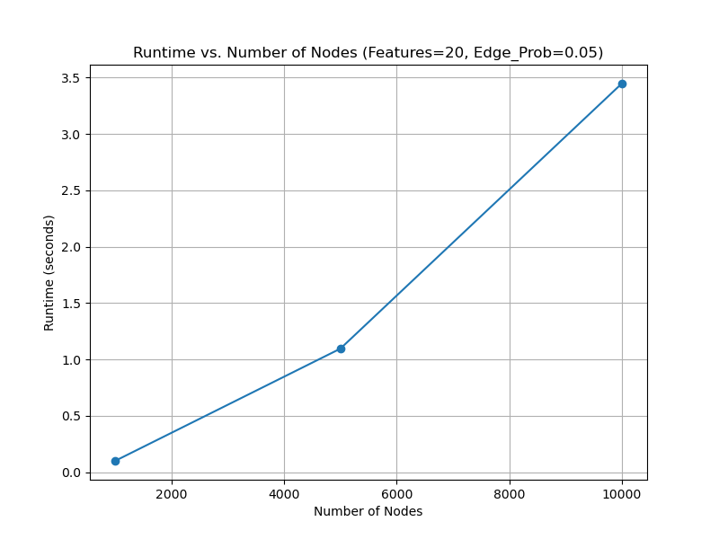
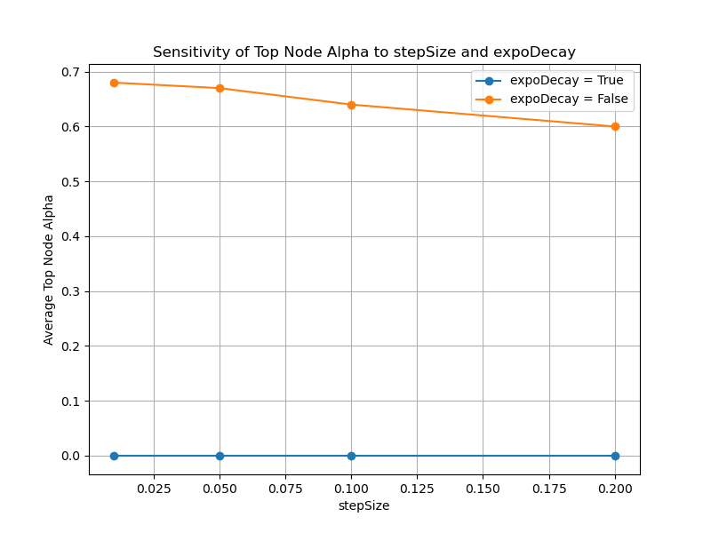
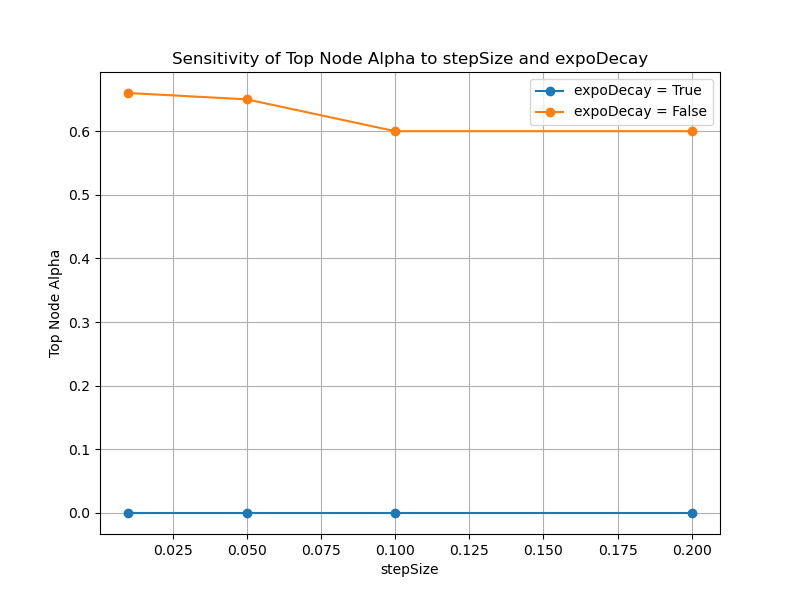

# demo
# AlphaCore: Data Depth Based Core Decomposition

AlphaCore is a novel core decomposition algorithm that leverages data depth (specifically, Mahalanobis depth) to identify and rank the most central nodes in complex networks. Unlike traditional methods (e.g., k-core) that only consider the number of connections, AlphaCore integrates multiple node features, offering a more robust analysis of network structure.

## Overview

- **Multi-Dimensional Node Evaluation:**  
  AlphaCore computes a node’s centrality by considering various numerical attributes, not just simple degree.
  
- **Mahalanobis Depth:**  
  It uses Mahalanobis depth to measure how "central" each node is relative to the overall feature distribution. A higher depth indicates a node is more typical (or core) within the network.
  
- **Iterative Core Decomposition:**  
  The algorithm iteratively removes nodes based on a dynamic threshold (epsilon) and assigns an alpha value (α = 1 - epsilon) when they are removed. Different decay strategies (linear vs. exponential) influence how quickly nodes are pruned.

## Scalability Analysis

In the scalability experiments, random directed graphs were generated with:
- **Node Counts:** 1,000, 5,000, and 10,000 nodes.
- **Feature Counts:** Varying from 6 to 100.
- **Edge Probabilities:** From 0.01 to 0.3 in increments of 0.005.

### Key Findings
- **Non-Linear Runtime Increase:**  
  The runtime increases non-linearly with graph complexity. For example, a graph with 5,000 nodes, 20 features, and an edge probability of ~0.16 took approximately 2–2.5 seconds to process.

### Figure 1: Scalability Plot
  
*Figure 1: Runtime vs. Number of Nodes for a fixed feature count and edge probability, illustrating non-linear scaling.*

## Sensitivity Analysis

For sensitivity analysis, a smaller graph (1,000 nodes, 6 features, edge probability 0.05) was used. The experiments varied:
- **stepSize:** [0.01, 0.05, 0.1, 0.2]  
- **expoDecay:** Tested both True and False.

### Key Findings
- **Exponential Decay (expoDecay=True):**  
  The top node’s alpha consistently remained 0, indicating an aggressive threshold reduction (high-depth nodes are removed immediately).
  
- **Linear Decay (expoDecay=False):**  
  The top node's alpha ranged from approximately 0.60 to 0.68, showing a gradual threshold reduction that allows core nodes to survive longer.

### Figure 2: Sensitivity Analysis (Averaged Results)
  
*Figure 2: Average top node alpha versus stepSize, comparing exponential decay and linear decay.*

### Figure 3: Sensitivity Analysis (Detailed View)
  
*Figure 3: Detailed sensitivity analysis showing individual run variability of top node alpha values for different parameter settings.*

## Contributions and Future Work

We encourage the community to contribute to this method. If you work with NetworkX or igraph and have ideas for enhancements or further optimizations, please reach out or submit a pull request. Your contributions can help refine AlphaCore for a wide range of network applications.

## How to Run

- **Scalability Experiment:**  
  Run the provided scalability experiment script (`scalability_experiment.py`) to measure runtime across various graph configurations. Results are saved in `scalability_results.csv` along with the plot.

- **Sensitivity Experiment:**  
  Run the sensitivity experiment script (`sensitivity_analysis_avg.py`) to see how parameter variations affect the node ranking. The results and plots are saved as `sensitivity_analysis_avg.png` and `sensitivity_analysis.png`.

## License

This work is licensed under the Creative Commons Attribution International 4.0 License.

---

Please contact the respective communities (NetworkX and igraph) if you'd like to contribute or have suggestions for improvements.

